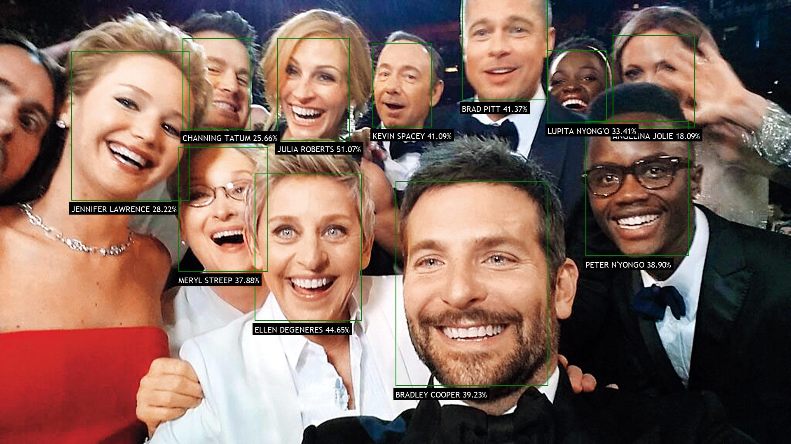
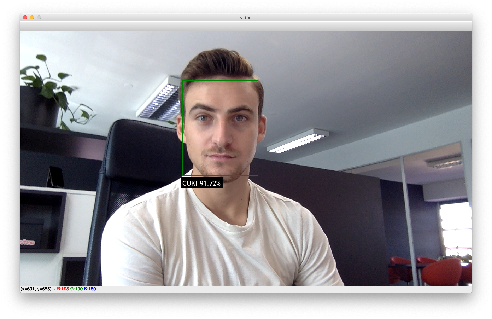

This repository provides a framework for creating and using Face Recognition system. 

# Installation
Make sure you have [Python 3.5+](https://realpython.com/installing-python/) and 
[`pip`](https://www.makeuseof.com/tag/install-pip-for-python/) installed.

Install dependencies
```
pip install -r requirements.txt -f https://download.pytorch.org/whl/torch_stable.html
```

# Train Face Recognition system
In order to train Face Recognition system user needs to provide images of people in a folder with following structure: 

```
- images 
    - person1
        - person1_1.png
        - person1_2.png
        ...
        - person1_n.png
    - person2
    ...
    - personN
    ...
```

Every directory contains images of one person (the more images the better), every image must contain only one face of a 
person.

After preparing images run following command to train Face Recognition system:
```
./tasks/train.sh path/to/folder/with/images
``` 
Previous command will generate `model/face_recogniser.pkl` which represents trained Face Recognition system.

# Using Face Recognition

After training Face Recognition system you can use it in several ways. You can use one of inference scripts or REST API. 

## Inference scripts

`inference` directory contains scripts which can be used with trained Face Recognition system.

#### `classifier.py`
Script for detecting and classifying faces on user-provided image. This script will process image, draw bounding boxes 
and labels on image and display it. It will also optionally save that image.
```
python -m inference.classifier -h
```
```
usage: Script for detecting and classifying faces on user-provided image. This script will process image, draw bounding boxes and labels on image and display it. It will also optionally save that image.
       [-h] --image-path IMAGE_PATH [--save-dir SAVE_DIR]

optional arguments:
  -h, --help            show this help message and exit
  --image-path IMAGE_PATH
                        Path to image file.
  --save-dir SAVE_DIR   If save dir is provided image will be saved to
                        specified directory.
```
Example output (model trained with one image of each person):



#### `video_classifier.py`
Script for detecting and classifying faces on video stream, it connects to default camera and performs face detection 
and classification on every frame.
```
python -m inference.video_classifier
```

Video stream example:


## Face Recognition API
You can use trained Face Recognition system as REST API, `api` folder contains simple 
[Flask](https://palletsprojects.com/p/flask/) API which provides frontend for Face Recognition system.

Run server using following command:
```
tasks/run_server.sh
```

Server is running on port `5000`.
Swagger API docs are available upon running server on `<root-url>:5000/docs`

``POST /face-recognition``

Example response:
```
{
    "faces": [
        {
            "top_prediction": {
                "label": "person1",
                "confidence": 0.9051724841669186
            },
            "bounding_box": {
                "left": 3103.2939949035645,
                "top": 920.1620543003082,
                "right": 3484.597170829773,
                "bottom": 1605.22814142704
            }
        },
        {
            "top_prediction": {
                "label": "person2",
                "confidence": 0.5193666400755098
            },
            "bounding_box": {
                "left": 1985.1384818404913,
                "top": 950.2878819331527,
                "right": 2383.1231556087732,
                "bottom": 1566.2133588716388
            }
        }
    ]
}
```

### Docker
Easiest way to run Face Recognition API is through Docker container.

Build image
```
docker build -t face-recognition-api:latest -f api/Dockerfile .
```

Run server
```
docker run --name face-recognition-api -d -p 5000:5000 face-recognition-api
```

> WARNING If you are processing high-resolution images in a containers limited amount of memory you could encounter OOM. 

## References
* F. Schroff, D. Kalenichenko, and J. Philbin. Facenet: A unified embedding for face recognition and clustering. arXiv preprint arXiv:1503.03832, 2015. [PDF](https://arxiv.org/pdf/1503.03832.pdf)
* Zhang, K., Zhang, Z., Li, Z., Qiao, Y.: Joint face detection and alignment using multi-task cascaded convolutional networks. arXiv preprint arXiv:1604.02878 (2016) [PDF](https://arxiv.org/pdf/1604.02878.pdf)
* [https://github.com/timesler/facenet-pytorch](https://github.com/timesler/facenet-pytorch)
* [https://github.com/davidsandberg/facenet](https://github.com/davidsandberg/facenet)